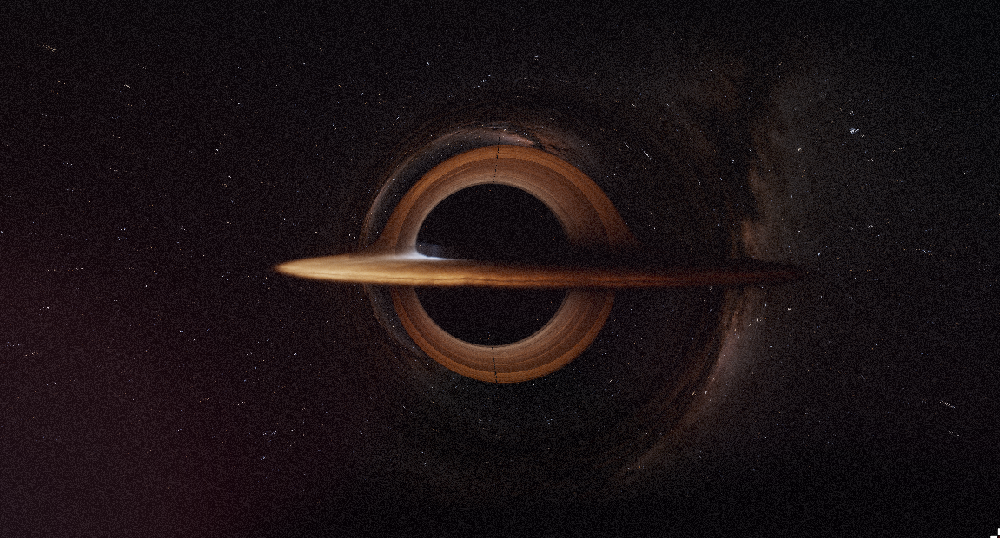

# BlackHole Simulator


This project is a real-time visualization of a Schwarzschild black hole built with C++ and OpenGL. It uses a custom ray tracer that integrates photon paths under the Schwarzschild metric using a Dormand–Prince (5)4 solver, producing realistic gravitational lensing. The render also features a volumetric accretion disk with doppler shifting and disk scattering effects, a NASA starmap converted into a cubemap for the background texture, and ACES tone mapping to create a cinematic effect.

### Requirements 
- C++17 compiler
- OpenGL 4.3+
- GPU with compute shader support

### Building
#### 1. Clone the repository
```bash
git clone https://github.com/taran1sdev/BlackHole.git
```
#### 2. Prepare the Star Cubemap
Download the original starmap (8k .exr) from the [NASA website](https://svs.gsfc.nasa.gov/4851/).

Convert the .exr file to .hdr format with [oiiotool](https://openimageio.readthedocs.io/en/latest/oiiotool.html)
```bash
oiiotool starmap_2020_8k.exr -o stars.hdr
```

Convert the .hdr to a RGBA16f cubemap with [cmft](https://github.com/dariomanesku/cmft).
```bash
cmft --input stars.hdr \     
     --output0 stars \
     --output0params dds,rgba16f,cubemap
```

#### 3. Create the assets directory
```bash
mkdir assets
mv stars.dds assets/stars.dds
```
#### 4. Build and run
```bash
mkdir build
cd build
cmake ..
make
./blackhole
```

This project was built and tested on linux (6.17.9-arch1-1) using the GCC 15.2.1 compiler, it has not been tested on Windows or MacOS.
